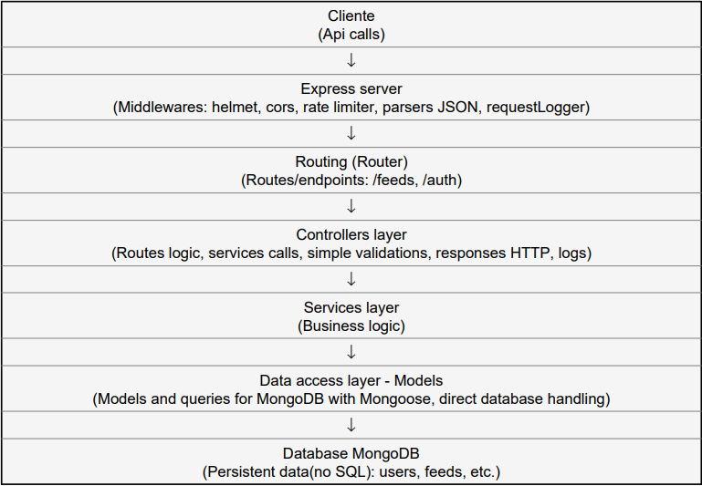

# DailyTrends API

## Descripción

API para gestión y scraping de feeds con autenticación, validación y manejo centralizado de errores.  

## Tecnologías usadas
- Node.js + Express
- TypeScript
- Zod (Validación de esquemas)  
- Mongoose (ODM para MongoDB)
- Bcrypt (Hash de contraseñas)
- Axios (Peticiones HTTP)
- Jest + Supertest (Testing y mocks)
- Winston (Logging personalizado)
- Swagger (Documentacion API)

## Instalación y ejecución

1. Clonar el repositorio:
  git clone <https://github.com/ivanpuebla10/DailyTrends.git>

2. Instalar dependencias  
  npm install

3. Configurar variables de entorno (`.env`)  
- `PORT`  
- `MONGO_URI`  
- `JWT_SECRET`

4. Iniciar servidor en modo desarrollo  
  npm run dev 

5. Ejecutar tests  
  npm run test

## Resumen de endpoints

POST /auth/create → Creación de usuarios

POST /auth/login → Inicio de sesión / autenticación

GET /feed/ → Obtención de todas las noticias / feeds extraídos

GET /feed/top10 → Obtención de los 10 feeds mas actuales, 5 de la portada de el pais y 5 de el mundo

GET /feed/:id → Obtención de un feed específico por su ID

POST /feed/ → Creación de un nuevo feed (requiere autenticación)

POST /feed/scrape → Ejecutar scrapers para extraer y actualizar feeds de las portadas de el mundo y el pais(requiere autenticación)

PUT /feed/:id → Actualizar un feed existente por su ID (requiere autenticación)

DELETE /feed/:id → Eliminar un feed por su ID (requiere autenticación)

## Diagrama

La aplicación estará disponible por defecto en `http://localhost:3000`
La documentacion estara disponible por defecto en `http://localhost:3000/api-docs/`
